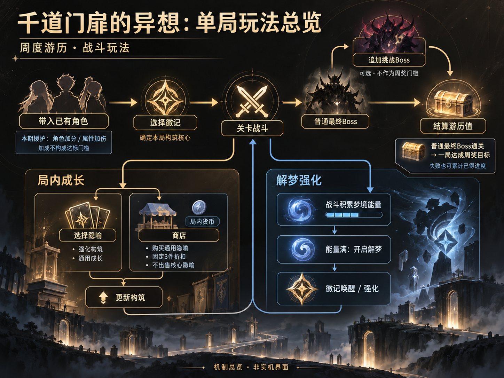
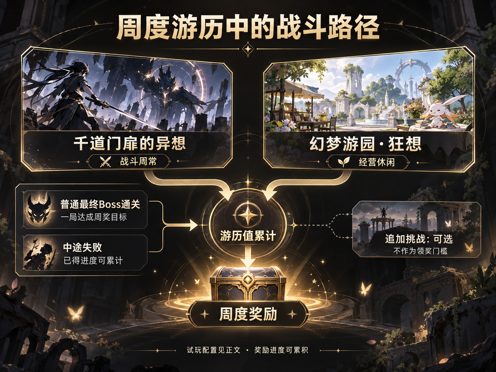
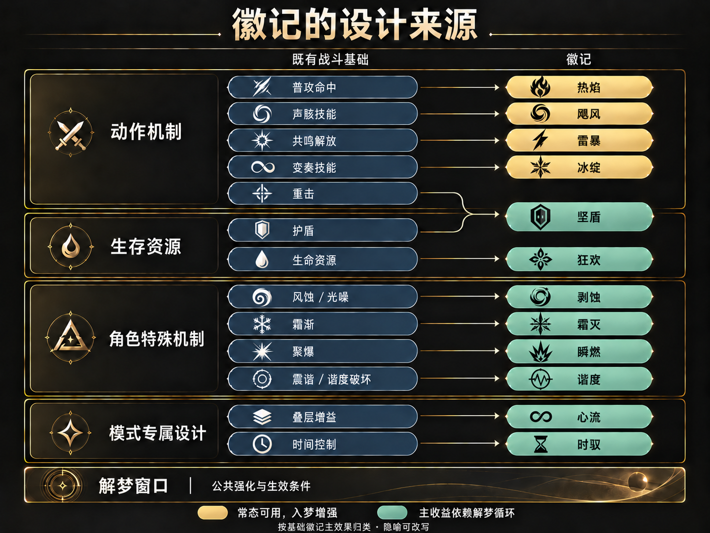
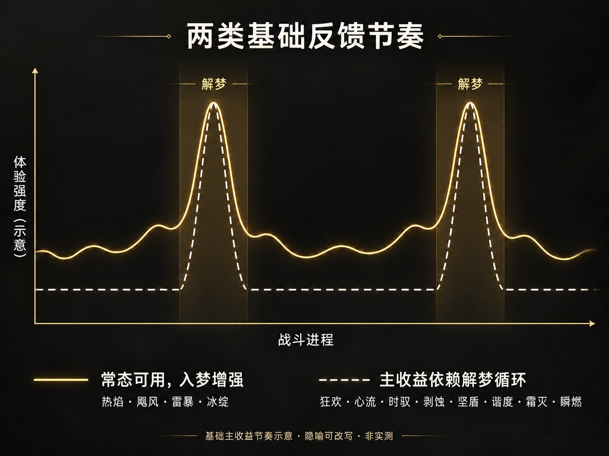
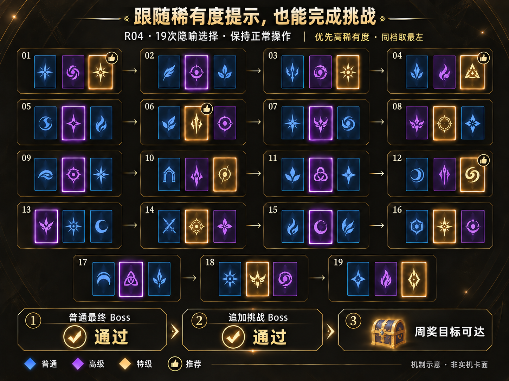
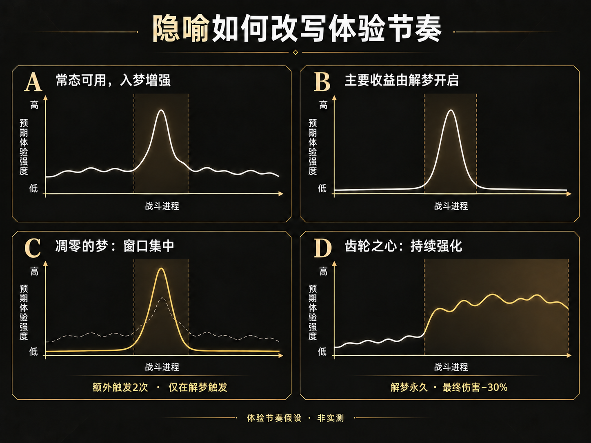
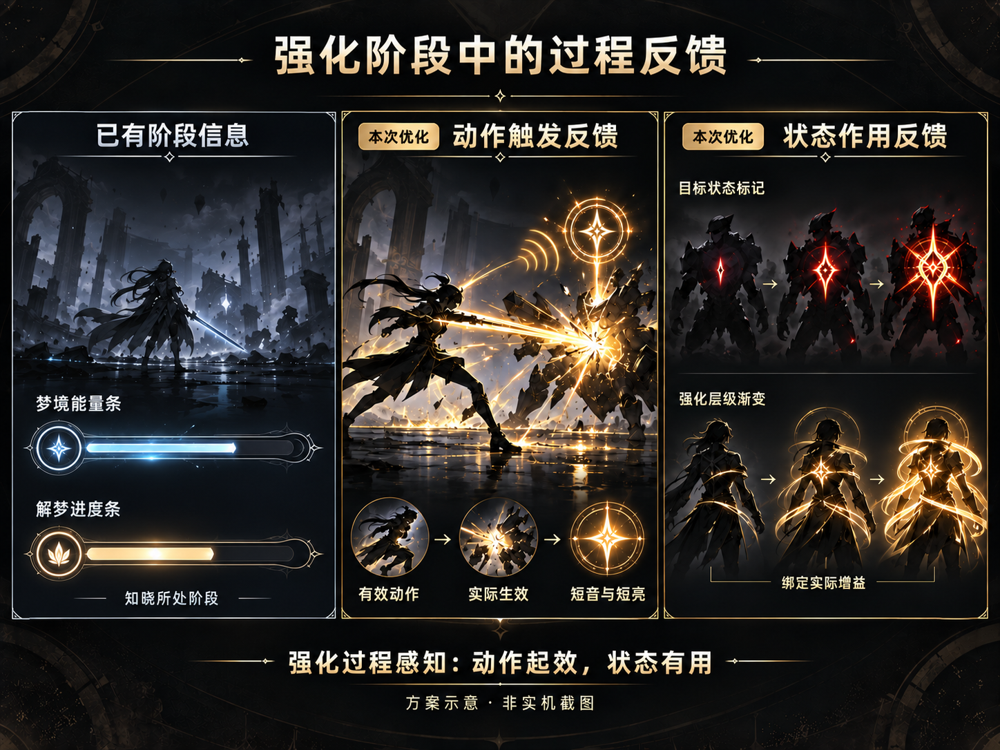
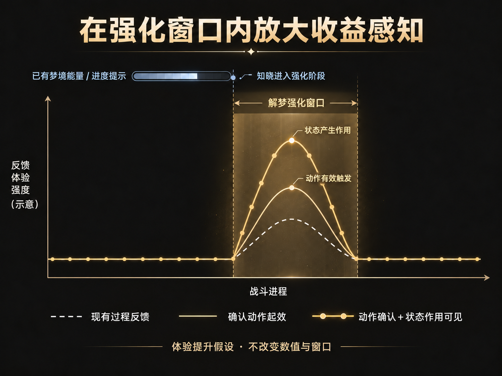

<!--
[INPUT]: 实际体验、作者案例/反馈批注、公开规则与绯雪机制核对、八张模型配图
[OUTPUT]: 系统拆解修订正文，明确周常与构筑上限、代表案例及角色认知/信息负担两项依据
[POS]: 仓库核心阅读件；批注原件在研究工作区保存，公开稿只有正文与附件，不包含录音
[PROTOCOL]: 变更时更新此头部，然后检查 CLAUDE.md
-->

# 《鸣潮》千道门扉的异想：构筑系统与战斗反馈拆解

v0.14案例与反馈修订版｜2026-10-07｜系统策划方向

千道门扉的异想是《鸣潮》周度游历中的战斗玩法。玩家带入已培养的角色，在一局内不断选择能力、调整打法、挑战关卡，通过结算游历值推进周奖励。它把动作战斗与肉鸽式成长结合起来：角色提供操作基础，局内选择让同一套角色获得不同的战斗循环。

理解一局只需先认识三个概念：**徽记**是开局选定的构筑核心；**隐喻**是随后取得的成长项，用于强化核心或提供通用能力；**解梦**是梦境能量充满后主动开启的强化状态，让徽记能力唤醒或增强。

*图1先呈现战斗、成长、解梦和结算的关系；局内成长机会穿插在关卡推进中。*

本案登记六局，明确体验时驭、狂欢、雷暴、飓风、坚盾五条路线，其中第三至第六局有录音转写。队伍主要使用绯雪、千咲、维里奈；绯雪、千咲均为零共鸣链并装备专属武器，以常规抽取与养成可达的队伍作为参考基线。研究重点是系统关系、设计取舍与有限改动，图中曲线均为体验假设；详细版本、记录口径及未覆盖项集中放在文末附件。

## 一、玩法定位与基础循环

在周度游历中，千道门扉的异想承担战斗体验，幻梦游园·狂想承担经营休闲体验，两种玩法共用游历值与周奖励进度。玩家可以按偏好选择参与方式。[官方周度游历说明](https://www.taptap.cn/moment/812806954857530196)

*普通最终Boss通关即可达成本次试玩的周奖目标；追加挑战提供继续战斗的机会。*

实测不携带本期援护角色，从零完成普通最终Boss即可拿满周进度。中途失败或主动结束也会累计已得进度，玩家可以下一局继续完成目标。这样的结构降低了周度领奖的试错损失：既允许完整通关集中完成，也接纳分次积累。追加挑战不承担领取周奖励的门槛。

本期援护用角色加分和属性增伤引导编队，开局徽记则规定本局打法。本次未带援护角色也完成了每周奖励，说明加成不构成这条完成路径的门槛。

单局内部有两条相互配合的循环。战斗积累梦境能量，开启解梦后释放强化收益；推进关卡获得隐喻和货币，更新构筑后进入下一场战斗。局内只设一种购买货币，商店不出售核心隐喻，固定提供3件折扣商品，供玩家补充通用能力。能量决定强化时机，货币决定购买机会，游历值则连接周奖励，各自解决不同问题。

核心隐喻在选择节点强化流派，商店用有限预算补足通用能力。每周领奖的完成门槛与局内构筑的探索空间，因而需要分别评价。

## 二、设计来源：让既有战斗能力成为构筑入口

本章从设计来源和解梦依赖两方面展开，解释角色已有能力怎样形成构筑入口，以及强化状态怎样组织基础战斗节奏。

### 1. 十二项徽记怎样从角色机制展开

徽记的设计空间来自角色已有动作、资源和特殊机制，以及模式新增的能力组织方式。图3回溯具体来源，并按基础主效果区分解梦依赖；同一个徽记可以连接多个机制。

颜色仅比较未计隐喻改写的基础主效果，是按社区图鉴规则提出的分析分组；逐项依据见[触发条件核验](徽记触发核验.md)。

*金色为基础主效果常态可用、入梦增强；青玉色为主收益依赖解梦循环。隐喻可改写条件，常态准备和辅助效果另看规则。*

热焰、飓风、雷暴、冰绽分别借用普攻命中、声骸技能、共鸣解放和变奏技能作为入口。共鸣解放即角色大招；变奏是满足协奏条件后的入场技能；声骸技能是角色装备带来的另一种战斗能力。徽记给这些熟悉操作增加局内收益，玩家因而重新评价它们的使用频度与时机。

坚盾把护盾和重击连接起来：获盾积累荣耀，解梦中重击类伤害消耗荣耀并获得加深。狂欢则把生命消耗、回复和周期输出组织起来，使生存资源参与输出与风险判断。两者让角色原有的防御、生命和攻击能力，在局内形成新的收益关系。

剥蚀、霜灭、瞬燃、谐度沿用异常施加、失谐及破坏等特殊机制，再增加对应收益。它们涉及状态施加、次数积累、破坏或结算，提供了动作频度之外的构筑方向。心流的心相叠层，以及时驭的时间控制、时能积累与退出结算，则以模式专属规则组织战斗。

不同入口把队伍差异转化为不同循环：频繁大招、轮换声骸、积盾后重击或持续施加异常，所需资源和节奏各不相同。核心隐喻再补充来源、减少间隔或放大收益，使同一主题继续展开。

分析时还要区分“做了什么”和“造成什么伤害”。冰绽由变奏触发，额外输出归为共鸣技能伤害；狂欢的周期输出归为普攻伤害。坚盾·领域生成的重击类伤害，也不代表角色直接执行重击。伤害类别决定哪些增伤可以联动，动作来源决定玩家应得到什么反馈，这一区分直接影响后面的优化方案。

角色拥有某动作，未必能顺畅重复它。坚盾局中玩家从绯雪改用千咲；飓风局因声骸冷却轮换三人，维里奈也参与触发。适配要同时看动作条件、资源和使用频度，治疗角色也可能凭另一种能力参与构筑。

### 2. 解梦怎样组织基础反馈节奏

梦境能量控制何时能够开启解梦，解梦提供强化窗口；时能、荣耀、心相则属于具体徽记的派生资源。按基础徽记的主要收益，可分为“常态可用、入梦增强”和“主收益依赖解梦循环”两类。循环包含进入、期间与退出阶段。

*两条线共用解梦窗口与相同示意峰值，比较准备期和强化期，不比较数值强弱。*

热焰、飓风、雷暴、冰绽在常态已有基础触发，解梦再强化输出；其余八项的标志性收益依赖解梦循环；例如时驭在期间减速、积累时能，退出后结算伤害。前者在日常操作中持续得到反馈，再安排强化时机；后者更依赖准备资源、开启窗口、集中兑现。两类都仍要满足动作、事件、间隔或叠层条件。

公共窗口形成准备与强化的对比，但基础分类不等于整套构筑的开关。常态荣耀、技能回复和核心隐喻条件仍须分别判断，后续成长也会改写收益时段。

## 三、构筑为什么容易成型

本章用雷暴局说明稀有度提示怎样支持构筑成型，并区分容易完成挑战的路径与进一步研究联动的空间。

### 1. 跟随稀有度提示，也能完成挑战

稀有度和推荐标识给玩家提供快速筛选线索。本次选择雷暴时，玩家保持正常操作，主要跟随稀有度提示：优先最高档，同档取最左；商店先买折扣项，再用余钱买可负担的高稀有度商品。

*第四局的19次常规隐喻选择，不含开局与商店。卡色、图标和推荐位置为机制示意。*

这个选法取得了雷暴四项核心和义手刀，完成普通最终Boss，也通过了追加挑战。电挚补充大招资源并缩短冷却，失序取消雷暴触发间隔，义手刀提供解梦内额外触发，逐步接成更密集的输出循环。玩家后期感到充能很快，千咲能够频繁释放大招，说明简单线索也可以引向有效配合。

成型的便利由几层结构共同支撑：开局徽记先确定方向，配套核心继续强化方向，通用隐喻补充资源和属性，商店提供额外购买机会。稀有度提示让玩家在不逐条计算的情况下持续获得成长，降低了完成一局的选择负担。

### 2. 容易成型仍留下上限选择

这局也保留了玩家自己的判断。面对高原的梦与队长的铭牌，玩家认为暴击收益更适合已持有的毁灭预言，但仍按稀有度取高原的梦；面对璀璨黑石花与尘封的秘典，玩家更想要额外徽记触发，最后仍取前者。

稀有度优先的选法已经能够顺利通关、完成领奖目标；在此基础上，理解联动还能帮助玩家挑选更合适的资源和伤害收益，追求更高的构筑上限。本案倾向保留这种分层：每周领奖不必先精通全部条目，愿意仔细选择的玩家则有继续优化构筑的空间。

## 四、隐喻如何改变打法与体验节奏

本章以凋零的梦和齿轮之心为例，讨论隐喻怎样改变打法、资源需求和风险取舍，再由这些变化引出过程反馈的需求。

### 1. 凋零的梦：把收益集中到窗口

凋零的梦令徽记每次触发时额外触发2次，代价是只能在解梦中触发。对原本常态可用的飓风，这意味着放弃部分日常触发，把收益集中到强化窗口。[凋零的梦](https://wuwa.wiki/zh-hans/codex/metaphors/2690057)

第五局前期，玩家围绕声骸冷却轮换三人；取得凋零后，改为积攒梦境能量，在解梦内集中释放声骸。这次选择改变了能力使用时机，等待、准备与释放之间形成更明显的对比。已有奇境梦蝶带来的延时，也因此成为安排窗口的配套条件。

对于原本就依赖解梦的收益，同一条“仅解梦触发”限制产生的影响又不同。通用隐喻通过改变可用时段，与不同徽记形成不同的交换关系，价值取决于原循环。玩家更喜欢飓风局后半段的集中释放，是这一转向的实际体验依据。

### 2. 齿轮之心：持续强化重排需求与风险

齿轮之心把解梦持续时间改为永久，代价是最终伤害降低30%。强化持续方式变化后，原本用于回能和延长窗口的收益吸引力会改变，玩家开始重新安排后续选择。[齿轮之心](https://wuwa.wiki/zh-hans/codex/metaphors/2690037)

狂欢局取得齿轮后，玩家面对回能、延时和普攻增伤，转而选择铭牌；随后也更愿接受动力锤缩短解梦时长的代价。这展示了规则变化如何重排需求：前一项成长不只提高当前能力，也改变下一项成长的价值。

持续强化同时延长了狂欢失血带来的压力。玩家最初期待永久解梦配合忘返能够反复免死，阵亡后认识到两者的持续条件不同。之后重新评价齿轮，明确自己不喜欢持续失血的紧张感，只有安全性或持续作战收益足够时才愿承担代价。永久状态、致命伤保护和风险偏好共同影响选择。

坚盾局又出现另一种判断：玩家因回能已经充足而主动拒绝齿轮。这与狂欢的生命压力属于不同理由。一个高影响道具可以在不同构筑阶段被接受或放弃，体现了资源供给、收益形式和个人偏好的共同作用。

*图中完整标出凋零的梦、齿轮之心及其效果；曲线表达机制带来的节奏假设。*

其他隐喻也会调整解梦循环：[守望的承诺](https://wuwa.wiki/zh-hans/codex/metaphors/2690035)以普攻命中回能，[高原的梦](https://wuwa.wiki/zh-hans/codex/metaphors/2690020)提高回复效率，帮助更快准备下一次解梦；[奇境梦蝶](https://wuwa.wiki/zh-hans/codex/metaphors/2690016)延长持续时间，[动力锤](https://wuwa.wiki/zh-hans/codex/metaphors/2690036)则缩短时间、换取伤害加成。

这些效果调整开启频率、强化覆盖与收益交换。本文选择凋零和齿轮，是因为前者把触发集中到有限窗口，后者让强化持续覆盖，鲜明地呈现了集中释放与持续作战两种方向。两局又有选择前后的操作与资源需求变化，可以把规则怎样改变打法讲清楚。

### 3. 从阶段信息到过程感知

已有能量条和解梦过程条告诉玩家所处阶段，但阶段明确不等于收益清楚。额外攻击可能混在密集特效中，荣耀消费和增益叠层也未必容易辨认。试玩中的重击收益疑问、永久解梦与免死混同，提示需要进一步表达动作和状态的实际作用。

## 五、优化方案：增强强化窗口内的收益感知

本章从角色动作认知和状态信息负担出发，提出动作确认、状态可见两类反馈，并说明其表现方式及与解梦窗口的关系。

### 1. 设计依据与反馈分类

角色动作的差异与表现，是本案关注的战斗体验价值。以绯雪为例，居合与强化重击各有形态、资源条件；本次试玩也因连续重击不顺而改用千咲。周常提供反复尝试较少使用动作的场景，清晰的触发回应可让玩家在操作中认识动作与构筑收益的关系。

另一个前提是状态信息的负担。绯雪已经涉及心念、寒意、雪锈等资源或状态，为徽记再叠加多个计数器会分散注意力。因此，方案用独立的声画线索，以及角色或目标上的可见变化表达实际作用，帮助形成收益的辨识与记忆。[绯雪技能条目](https://wuwa.wiki/zh-hans/codex/resonators/1108)

据此，**动作触发反馈**确认有效操作的结果，**状态作用反馈**显示增益的对象和强弱，让玩家在战斗中感到操作和构筑的联系。

*左栏为已有阶段信息；中、右两栏分别展示动作确认与状态作用的优化方向，界面为功能示意。*

同一徽记可包含两类反馈：离散收益用短音和局部响应，持续增益用状态标记。表现跟随真实事件，复用原有能量条，不改触发条件、数值和奖励。

### 2. 动作联动：让有效动作取得即时确认

雷暴在实际发动时增加克制的电击短音和徽记响应。基础触发间隔内不制造成功提示，取得失序后按取消间隔的规则判断。整组多段伤害共用一次主要确认，避免每段都被听成新的操作成功。

飓风在额外飓风形成时确认声骸动作的结果，凋零或斩浪带来的连锁使用较轻变化，区分原操作与后续输出。冰绽则应在变奏触发收益时确认，普通换人不采用相同提示。动作与结果的稳定关联可以提供学习线索。

坚盾区分直接动作和领域生成的重击类伤害。实际荣耀消费时，前者用金属短音与局部响应，后者反馈较轻；无法区分来源时只表达收益生效。绯雪部分强化重击实为共鸣解放伤害，不能仅凭技能名称制造“重击生效”提示。[技能说明](https://wuwa.wiki/zh-hans/codex/resonators/1108)

### 3. 状态增益：让作用对象和强弱可见

狂欢·浸染对目标施加狂乱、提高其受到的伤害，可用目标上的裂纹或撕裂印记表达。层数增长时加深，消退或目标死亡后同步清除，范围以不遮挡敌人动作轮廓为准。

角色自身的强化绑定实际增益。例如狂欢·极乐提高生命上限时，血纹或光晕逐层增强；狂欢·沉沦的增伤也在实际成立时变化。表现依据增益，不能仅因生命持续下降就显示强化越来越高。颜色和材质需要与低生命警示、敌人危险预告区分。

心流主要表达心相层数与状态强弱，持续表现为主，关键层级可辅以轻提示。频度由可读性和混音测试确定，避免每次伤害都播放强音。玩家由此能持续认识“我和目标处于什么状态”，无需在战斗中逐字读取所有比例。

*已有提示标出进入强化阶段；两类改动在同一窗口内提升收益感知。三条曲线为预期模型。*

图8将方案与既有信息连接起来。梦境能量和进度提示告诉玩家何时进入“黄金体验区”；第一层确认有效动作，第二层进一步让自身或目标受到的影响可见。两层共同强化窗口内的体验，窗口长度和数值保持既有规则，提升来自玩家更清楚地感知收益。

## 六、落地与验收

策划先定义效果的生效条件、动作来源、持续及结束事件；战斗程序在规则成立后通知表现层，音频负责质感、连锁与混音，界面和特效负责图标、标记及遮挡。高频表现可以合并，真实触发和伤害结算按原规则执行。

首批用雷暴、飓风、坚盾验证动作反馈，以狂欢检查持续表现。比较相同片段或可控原型：玩家能否辨认生效、理解动作条件，是否误认自动伤害，操作后是否更满足。再检查密集战斗、正常混音及静音时的识别与负担。

若辨识改善却变吵，降低表现频度和强度；若产生错误教学，修正来源区分；若状态标记遮挡敌人，缩小范围。辨识和满足感分别评价，允许只获得信息表达收益。方案的价值由真实战斗验证，当前不预设体验或留存的提升幅度。

---

资料与记录：原基础规则基线3.7.9，飓风、坚盾专项3.7.11，部分品质3.7.12；10/07以当前3.7.12复查十二基础及六项相关核心，补充隐喻和角色技能同日核对。玩法入口与每周奖励体系参考官方3.4与3.7说明。六局不是全角色或全徽记的平衡比较；尚无完整实机音画记录。第四局走困难分支，两阶段通过，当时周进度已满；从零普通通关满进度来自此前确认。曲线是概念模型，冰绽反馈是规则候选，具体方案尚未实装。

附件：[游玩记录与证据索引](records/README.md)｜[来源与方法](来源与方法.md)｜[徽记触发核验](徽记触发核验.md)｜[图片提示词与模型记录](imagegen/README.md)。
